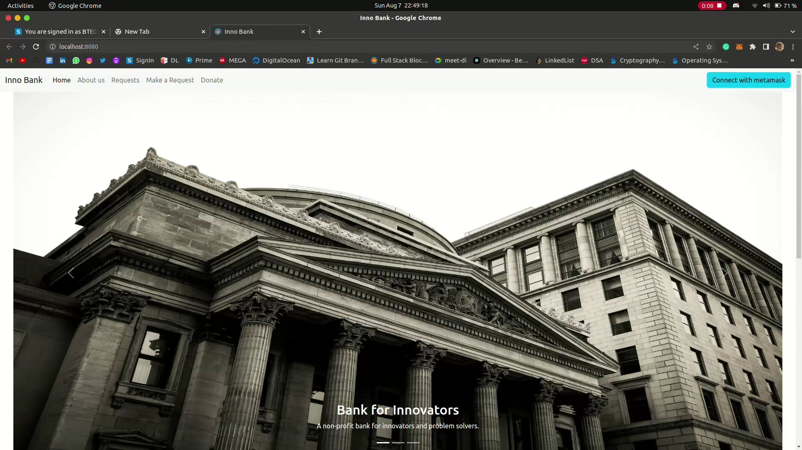
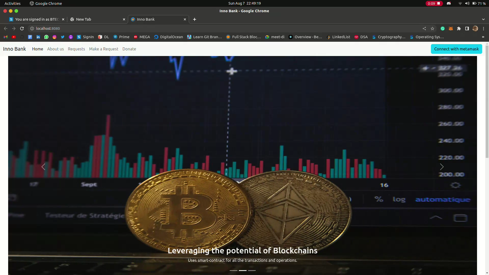
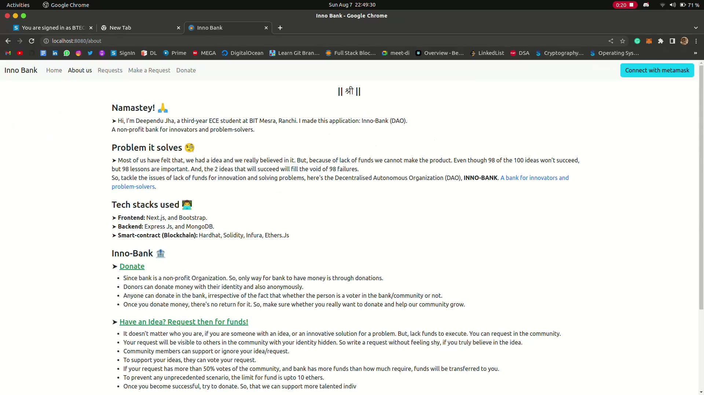
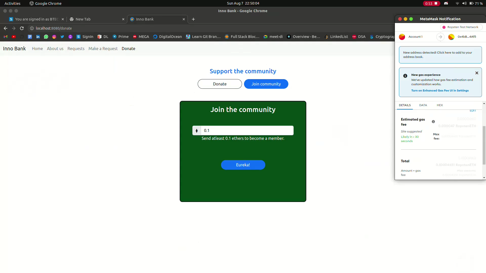
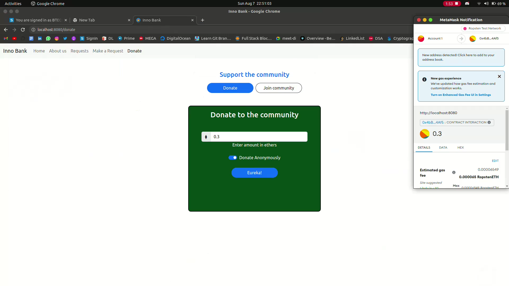
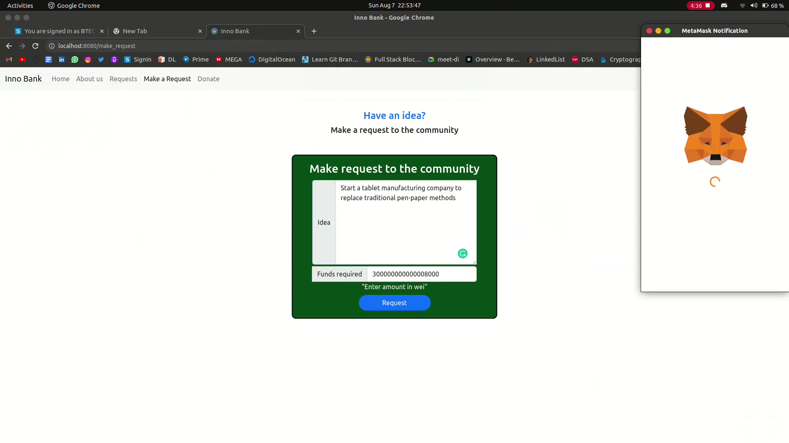
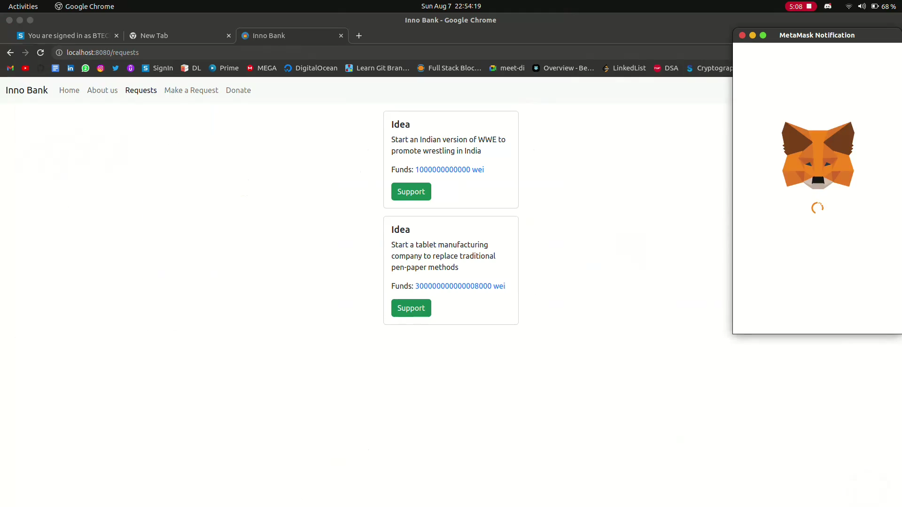

# Inno Bank (a DAO project)

## (A non-profit bank for innovators and problem-solvers)
This project was made for **'Web3Hack'** a hackathon organized by **['CryptoNaukri'](https://www.cryptonaukri.com/)**. Our team, **"Wild Rose"**, a team of two undergrads, [Deependu Jha](https://github.com/deependujha), and [Nitesh Kumar](https://github.com/niteshKrr) took part in this hackathon and did our best to complete this project in even less than 2 days.
 
 
Our project is about the **lack of funds one has when trying to start a venture/ solving a problem**. So, DAO comes to rescue. Inno Bank is a non-profit bank for innovators and problem-solvers.
 
➤ Most of us have felt that, we had a idea and we really believed in it. But, because of lack of funds we cannot make the product. Even though 98 of the 100 ideas won't succeed, but 98 lessons are important. And, the 2 ideas that will succeed will fill the void of 98 failures.
 
So, tackle the issues of lack of funds for innovation and solving
problems, here's the **'Decentralised Autonomous Organization (DAO)'**
 

### Request to the community regarding your idea

- It doesn't matter who you are, if you are someone with an
  idea, or an innovative solution for a problem. But, lack
  funds to execute. You can request in the community.
- Your request will be visible to others in the community with
  your identity hidden. So write a request without feeling
  shy, if you truly believe in the idea.
- Community members can support or ignore your idea/request.
- If your **request has more than 50% votes of the community**,
  and bank has more funds than how much require, **funds will be
  transferred** to you.
- To prevent any unprecedented scenario, the limit for fund is
  upto 10 ethers.
   

### Donate money to the bank

- Since our bank is a non-profit Organization. So, only way for
  bank to have money is through donations.
- Donors can donate money with their identity and also
  anonymously.
- Anyone can donate in the bank, irrespective of the fact that
  whether the person is a voter in the bank/community or not.
   

### Become a member of the community

- To join the community, you need to donate atleast 0.1
  ethers.
- Once you have donated, then you can support the ideas and
  get involved in the community.

## Tech-stacks used

- **Next.Js** for frontend
- **Express Js** as backend
- **Hardhat** for blockchain part
- and, **Ether.js** for interacting with the blockchain.

## Project

- **'Home page'** is the welcome page of our DAO. At the right-side of the navbar, you can see the 'connect with metamask' button to do the same.

- **'About'** page is about what the whole project is about, and what our community stands for.
  

- **'Donate'** is where you can either donate to the bank, or by clicking on join the community, you can join the community by donating over 0.1 ethers.
  
  

- **'Make a request'**, here you can make a request to the community discussing your idea and the funds that you would require.
  

- **'Requests'** is the place where you will see the requests made by the members of the community. If you are one of the members of the community, then you can choose to support the idea that you really like.
  

**Once a request has more than 50% of the votes, and our bank has more funds than asked for, then required funds will be transferred to the one who requested it.**

## See the screen recording of the project:

[Click here to see the screen-recording of the project](https://drive.google.com/file/d/121uZAt0qMx2GNGj4_nAj72N4ZvgrDBQe/view)

## See code of smart-contract & backend:

[smart-contract](https://github.com/deependujha/inno_bank_smart_contract)
 
[backend](https://github.com/deependujha/inno_bank_backend)

#### Thanks.
